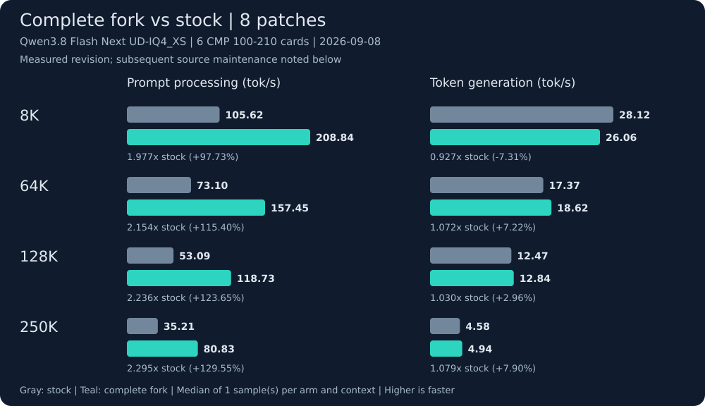

# llama.cmp-v: llama.cpp for NVIDIA CMP 100-210 (CMP 100HX-210)

**This fork targets NVIDIA CMP 100-210 / CMP 100HX-210 cryptocurrency mining cards for local LLM inference.** These NVIDIA Volta / GV100 cards use CUDA compute capability 7.0 (SM70), but their mining configuration has restrictions that ordinary GPU inference builds do not account for.

The tested CMP configuration has PCIe Gen1 x1 links, no usable CUDA peer-to-peer path between cards, and rejected Nsight CUDA profiling. These restrictions make model uploads, host-staged multi-GPU transfers and kernel submission expensive. The patches address those costs and add SM70-specific execution paths. They do not unlock hardware, change firmware or turn a CMP into a fully enabled Tesla V100. Modified boards can behave differently; the exact enforcement mechanism is not established by these measurements.

The source includes seven inherited patches plus the accepted SM70 D256 shared-Q and unit-rescaling patch. Public measurements retain regressions and validation limits. Gains depend on the model, request and hardware configuration.

- [Hardware and limitations](https://josephur.github.io/llama.cmp-v/hardware/)
- [Patch descriptions](https://josephur.github.io/llama.cmp-v/patches/)
- [Accepted measurements](https://josephur.github.io/llama.cmp-v/results/)
- [Binary releases](https://github.com/Josephur/llama.cmp-v/releases)

SM70 binary builds use **CUDA 12.9.2** and **`CMAKE_CUDA_ARCHITECTURES=70-real`**. CUDA 13 removed offline compilation support for Volta. A successful build establishes the compiled target, not correctness or performance on every CMP configuration. The NVIDIA driver must support the card and CUDA runtime.

## Complete patch series

All eight patches are in [one directory](https://github.com/Josephur/llama.cmp-v/tree/main/cmp/patches), with a manifest specifying their application order and upstream base. The public source already contains the complete series. Both Linux and Windows SM70 binaries compile that complete source; they are not separate per-patch builds.

<!-- BEGIN GENERATED STOCK COMPARISON -->
## Complete fork versus stock



**Model:** Qwen3.8 Flash Next UD-IQ4_XS. **Hardware:** 6 native CMP 100-210 cards. **Measured:** 2026-09-08 (America/Indiana/Indianapolis).

**Coverage:** 8 patches; stock `4d9176092d00`, fork `63a8992d5b22`. Median of 1 sample(s) per arm/context; exactly 256 generated tokens with byte-exact output.

**Source maintenance after measurement:** The measured Linux build is 63a8992d5b22. Subsequent commit 4f7bbe595be9 adds GGML_API visibility declarations and includes ggml.h for Windows DLL exports; it changes no selector implementation or CUDA kernel. Source review supports retaining these eight-patch Linux measurements, but the later revision was not benchmarked and these results make no Windows performance claim.

| Prompt tokens | Server context | Prefill: stock → fork (tok/s) | Generation: stock → fork (tok/s) | Request time change |
| ---: | ---: | ---: | ---: | ---: |
| 8,192 | 8,448 | 105.62 → 208.84 | 28.12 → 26.06 | -43.42% |
| 65,536 | 66,048 | 73.10 → 157.45 | 17.37 → 18.62 | -52.81% |
| 131,072 | 131,328 | 53.09 → 118.73 | 12.47 → 12.84 | -54.85% |
| 250,000 | 250,368 | 35.21 → 80.83 | 4.58 → 4.94 | -56.05% |

Negative request time changes mean faster completion. Prompt processing gains are separate from generation speed.

### Copyable llama.cpp commands

Set `MODEL` to the first GGUF shard and `CTX` to a server context from the table. Set `CUDA_VISIBLE_DEVICES` to your six chosen cards before running either command. Run one server at a time.

**Stock:**

```bash
env llama-server \
  --jinja \
  --no-host \
  --no-repack \
  --load-mode mmap \
  --lazy-mode auto \
  --gpu-layers all \
  --split-mode layer \
  --batch-size 24576 \
  --ubatch-size 512 \
  --flash-attn on \
  --cache-type-k f16 \
  --cache-type-v f16 \
  --no-context-shift \
  --backend-sampling \
  --spec-type none \
  --metrics \
  --parallel 1 \
  --cache-ram 8192 \
  --ui-mcp-proxy \
  --webui-mcp-proxy \
  --ctx-size "$CTX" \
  --model "$MODEL" \
  --port 8080 \
  --host 127.0.0.1 \
  --n-predict 16384 \
  --device CUDA0,CUDA1,CUDA2,CUDA3,CUDA4,CUDA5 \
  --tensor-split 1,1,1,1,1,1
```

**Complete fork:**

```bash
env GGML_CUDA_MAPPED_HOST_BRIDGE=1 GGML_CUDA_PROMPT_GRAPH_CAPTURE_SEED=1 GGML_SCHED_DEVICE_MASK=1 LLAMA_MODEL_LOAD_PARALLEL=1 llama-server \
  --jinja \
  --no-host \
  --no-repack \
  --load-mode mmap \
  --lazy-mode auto \
  --gpu-layers all \
  --split-mode layer \
  --batch-size 24576 \
  --ubatch-size 512 \
  --flash-attn on \
  --cache-type-k f16 \
  --cache-type-v f16 \
  --no-context-shift \
  --cuda-mmq force \
  --backend-sampling \
  --spec-type none \
  --metrics \
  --parallel 1 \
  --cache-ram 8192 \
  --ui-mcp-proxy \
  --webui-mcp-proxy \
  --ctx-size "$CTX" \
  --model "$MODEL" \
  --port 8080 \
  --host 127.0.0.1 \
  --n-predict 16384 \
  --device CUDA0,CUDA1,CUDA2,CUDA3,CUDA4,CUDA5 \
  --tensor-split 1,1,1,1,1,1
```

Both binaries use CUDA 12.9.2, `70-real`, `GGML_NATIVE=OFF`, CPU features `SSE42 AVX AVX2 BMI2 F16C FMA`, and identical runtime phase instrumentation. Stock uses upstream automatic MMQ routing; the fork enables its documented MMQ route and selectors.

**Completion request settings** (the harness supplies an exact-length tokenized prompt):

```json
{
  "cache_prompt": false,
  "ignore_eos": true,
  "n_predict": 256,
  "seed": 1234,
  "stream": false,
  "temperature": 0,
  "top_k": 1
}
```

- Matched requests and byte-exact outputs establish this measured comparison, not exhaustive numerical equivalence.
- Single samples do not establish repeatability or statistical significance.
- Request wall time is measured after model readiness; it excludes startup and is not time to first token.
- Both arms include identical runtime phase instrumentation; stock has none of the 8 optimization-series patches.

[Benchmark details](docs/results/benchmarks.md) · [Machine-readable measurements](docs/results/data/current-stock.json)

<!-- END GENERATED STOCK COMPARISON -->

## Building the source

Follow the upstream [build documentation](../docs/build.md). Use CUDA 12.9.2, `CMAKE_CUDA_ARCHITECTURES=70-real` and `GGML_CUDA=ON`. Select a compatible host CPU baseline explicitly. Build and publishing automation stays private; downloadable binaries will appear on the public Releases page after their builds and checks pass.

## Documentation and evidence

Public documentation and derived measurements are under `cmp/docs/`. The correctness target is identical generated output in matched comparisons. Recorded evidence distinguishes exact-output checks, runtime activation and performance uncertainty. Source reconstruction alone does not establish a speedup.
