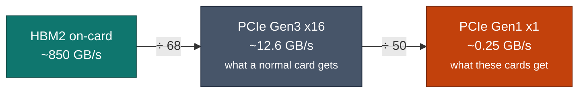
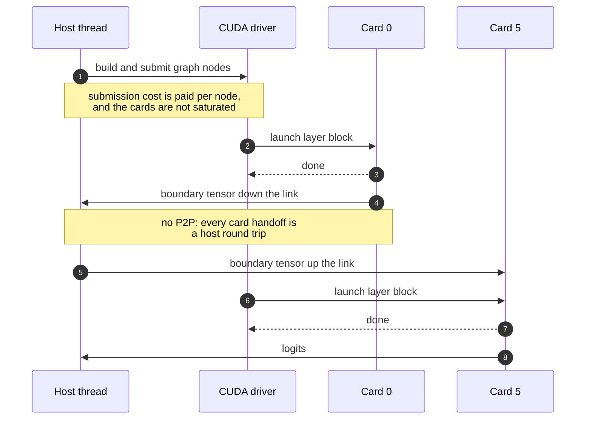

# The hardware

## What the card is

The CMP 100-210 is NVIDIA's Cryptocurrency Mining Processor built on the GV100
die: the same silicon as a Tesla V100, with the parts a miner does not pay for
removed. It reports as compute capability **7.0**, native SM70 Volta. Kernels
compile to real cubins; there is no PTX fallback and no forward-compatible JIT
path to lean on, so anything that assumes SM75+ features simply does not build
or does not run.

What is present is worth having: HBM2 at roughly 850 GB/s and the full Volta
tensor-core complement. What is absent is the whole design problem.

## What was taken away

-   :material-transit-connection-variant:{ .lg .middle } **PCIe Gen1, one lane**

    ---

    Around 250 MB/s each way. Not Gen3 x16, not Gen1 x16 — one lane at the
    oldest signalling rate. Host-to-device bandwidth is roughly 3,400&times;
    narrower than the card's own memory.

-   :material-link-off:{ .lg .middle } **No peer-to-peer, no NVLink**

    ---

    `cudaDeviceCanAccessPeer` is false for every pair. A tensor moving from one
    card to another traverses the link twice, through host memory, with nothing
    in the driver to hide it.

-   :material-chart-timeline-variant-shimmer:{ .lg .middle } **No CUPTI**

    ---

    NVIDIA disables the profiling interface on CMP parts. Nsight Systems,
    Nsight Compute and every hardware counter are unavailable. Attribution is
    done with CUDA events and in-process timing.

-   :material-monitor-off:{ .lg .middle } **No display, no video engines**

    ---

    Headless by construction. Irrelevant for inference, but it means the card
    is invisible to a great deal of tooling that expects a display device.

## Why the link dominates

Put the numbers on one scale and the strategy writes itself.

| Path | Bandwidth | Relative to the link |
| --- | ---: | ---: |
| HBM2, on-card | ~850,000 MB/s | **3,400&times;** |
| PCIe Gen3 x16, for reference | ~12,600 MB/s | 50&times; |
| **PCIe Gen1 x1, what these cards have** | **~250 MB/s** | 1&times; |

On-card memory is about three and a half orders of magnitude faster than the
link that feeds it. Anything that crosses the link is therefore worth removing
outright; compressing it is a second-best answer, and hiding it behind overlap
is a third.

This is why the patch series contains no new arithmetic kernels. Faster maths on
a card that is idle most of the wall clock buys nothing.

## Where the wall clock actually goes

On a six-card long-context request, the shape looks like this. The cards are
mostly waiting.

Three costs stand out, and each has a patch aimed at it:

| Cost | Patch |
| --- | --- |
| Per-node driver submission on idle cards | [Prompt graph capture seed](patches/prompt-graph-capture-seed.md) |
| Card-to-card boundaries staged ad hoc through the host | [Mapped pinned host bridge](patches/mapped-host-bridge.md) |
| Per-ubatch mask uploads across the link | [Device-side mask expansion](patches/device-side-mask-expansion.md) |

And two that are not inference at all but still dominate a cold start or a
prefill:

| Cost | Patch |
| --- | --- |
| Serial per-GPU weight upload at model load | [Parallel model load](patches/parallel-model-load.md) |
| Automatic MMQ policy choosing an unhelpful route on SM70 | [DP4A MMQ routing](patches/mmq-dp4a-routing.md) and [Q4_K / Q5_K coverage](patches/mmq-dp4a-q4k-q5k.md) |

## Consequences for anyone reproducing this

!!! warning "SM70 is a real constraint, not a compatibility flag"

    Build with an SM70-native toolchain. The pinned CUDA container in
    Builds emit `70-real` cubins with no PTX, so a binary
    either runs on these cards or fails immediately rather than JIT-compiling
    something slower at first launch.

!!! info "Machine-specific values are not in this repository"

    No host, device UUID, filesystem path or service name appears anywhere in
    the source tree or on this site. They live in a machine-specific
    configuration file that is never committed.
    An audit script enforces this on every commit.

!!! tip "Card count changes the answer"

    Several mechanisms here are worth more the more cards are in the split,
    because they act on boundaries between cards. A single-card result is a
    regression check, not a demonstration. Both appear in the
    [timeline](results/index.md), labelled.
