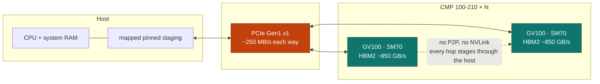

# Mining cards, made to serve tokens

The NVIDIA CMP 100-210 is a GV100 die sold for cryptocurrency mining. It has the
compute of a datacentre card and almost none of the plumbing: **one PCIe Gen1
lane**, no peer-to-peer path between cards, no NVLink, no display output, and no
profiler. Bought used, it is one of the cheapest ways to put a lot of HBM2 behind
a lot of FP16 throughput. Bought used, it is also a card that most inference
software quietly assumes does not exist.

This site is the engineering record of making llama.cpp run well on them anyway.

-   :material-speedometer:{ .lg .middle } **Not an arithmetic problem**

    ---

    The cards are usually *idle*, not saturated. On a six-card long-context
    request each card spends a small fraction of the wall clock doing
    arithmetic. The wins here are scheduling and transport, not faster kernels.

-   :material-lock-check:{ .lg .middle } **Byte-for-byte or it does not ship**

    ---

    A patch is retained only if enabling it leaves the generated tokens
    *identical* to leaving it off, at every context in the ladder. Faster but
    different is a rejected experiment, not an optimization.

-   :material-toggle-switch-off-outline:{ .lg .middle } **Activation is documented**

    ---

    Each result identifies the affected configurations and whether a runtime selector controls the change. Accepted source specializations can become part of the normal build.

-   :material-notebook-outline:{ .lg .middle } **Promotion includes the tradeoffs**

    ---

    The public [timeline](results/index.md) contains permanently adopted patches, with their measured regressions and validation limits. Ongoing and undecided tests remain private. Publication accompanies a permanent patch promotion.

## The shape of the machine

Everything in the patch series follows from one picture. Weights and activations
must cross a link roughly three orders of magnitude narrower than the memory the
cards themselves have, and any card-to-card traffic crosses it twice.

Three consequences drive every decision on this site:

1. **Bytes on the link are the scarce resource.** The right move is usually to
   *remove* a transfer, not to compress it. That is what
   [device-side mask expansion](patches/device-side-mask-expansion.md) does.
2. **Cross-card boundaries are host round trips.** With no peer path, a tensor
   handed from card 3 to card 4 goes down the link and back up it. Making that
   staging explicit and reusable is
   [the mapped pinned bridge](patches/mapped-host-bridge.md).
3. **Submission cost is not amortised by busy GPUs.** With mostly idle cards,
   driver submission dominates sampled CPU time, which is why
   [graph capture](patches/prompt-graph-capture-seed.md) matters more here than
   it would on a saturated node.

And one constraint on the method itself: NVIDIA disables CUPTI on CMP parts, so
Nsight and hardware counters are unavailable. Every number on this site comes
from CUDA events and in-process timing. See [Method](method.md).

## The series

Seven inherited source mechanisms, each with its own page. Their source patches are reconstructible. The results timeline records later optimization attempts and human acceptance decisions; source documentation alone is not performance certification.

| Patch | What it changes | Selector |
| --- | --- | --- |
| [Research selector registry](patches/research-selectors.md) | Infrastructure: selectors become runtime-switchable and their reads observable | — |
| [DP4A MMQ routing](patches/mmq-dp4a-routing.md) | Forces the integer-dot MMQ route for quantized prefill | `--cuda-mmq force` |
| [Volta Q4_K and Q5_K DP4A](patches/mmq-dp4a-q4k-q5k.md) | Extends that routing to two quantizations SM70 did not cover | `--cuda-mmq force` |
| [Parallel model load](patches/parallel-model-load.md) | Overlaps independent per-GPU uploads with positional reads | `LLAMA_MODEL_LOAD_PARALLEL` |
| [Mapped pinned host bridge](patches/mapped-host-bridge.md) | Explicit, event-ordered staging for no-P2P card boundaries | `GGML_CUDA_MAPPED_HOST_BRIDGE` |
| [Prompt graph capture seed](patches/prompt-graph-capture-seed.md) | Replays prompt graphs after a safe capture-only first observation | `GGML_CUDA_PROMPT_GRAPH_CAPTURE_SEED` |
| [Device-side mask expansion](patches/device-side-mask-expansion.md) | Sends a compact visibility hint and rebuilds the mask on the GPU | — |

[Read the series overview :material-arrow-right:](patches/index.md){ .md-button .md-button--primary }
[Browse the timeline :material-arrow-right:](results/index.md){ .md-button }

## Reading this site

- :material-chip: **[The hardware](hardware.md)**

    What a CMP 100-210 actually is, what it is missing, and which of those
    absences cost the most.

- :material-source-branch: **[The patches](patches/index.md)**

    One page per patch: the mechanism, the diagram, the selector, and what it
    is *not* claimed to do.

- :material-timeline-text: **[The timeline](results/index.md)**

    Permanently promoted patches with their measured tradeoffs, newest first. Backed by a
    [machine-readable index](results/index.json) for agents.

- :material-scale-balance: **[Method](method.md)**

    The promotion ladder, the byte-exactness gate, and why activation is proved
    by a log line rather than by an environment variable being set.

!!! quote "Attribution"

    Built and maintained by Joseph Stackhouse at
    [Stack-Tech](https://stack-tech.com). The patches are offered against
    upstream [llama.cpp](https://github.com/ggml-org/llama.cpp) under its MIT
    licence. See [About](about.md).
