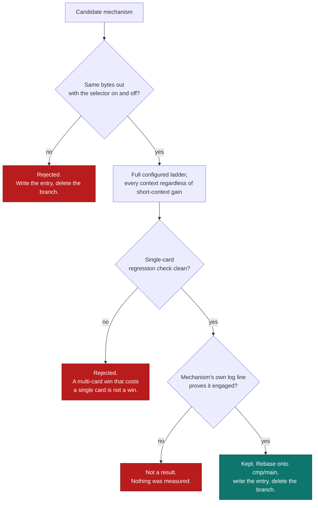
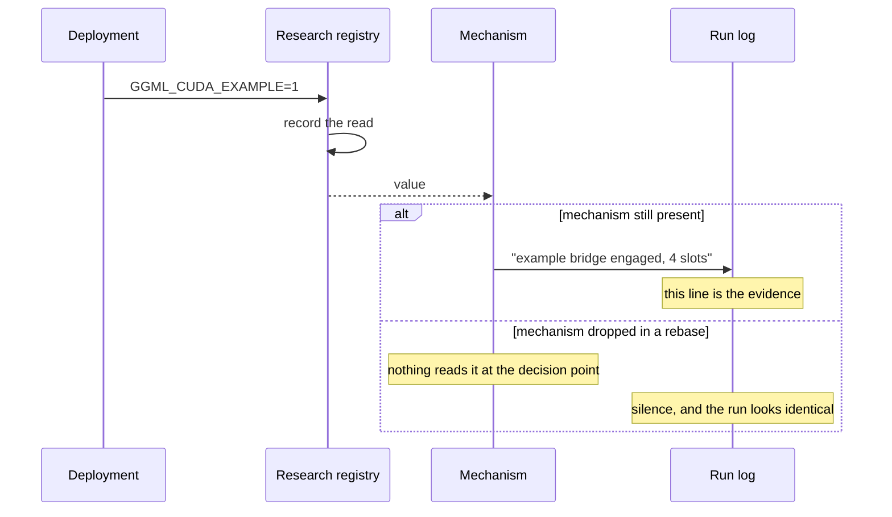

# Method

This is the required method for new experiments. Historical data may lack these checks and must be labelled accordingly; this document does not certify earlier runs.

## The correctness bar comes first

A change is retained only when enabling it leaves the generated tokens
**byte-for-byte identical** to leaving it off, at every context in the ladder.
Not statistically similar, not "the same answer worded differently" — the same
bytes.

This is a strong bar and it is chosen deliberately. Every mechanism here moves
bytes, reorders submissions or reuses buffers. Those are exactly the changes
that produce a plausible-looking answer while quietly corrupting a slot, and a
plausible-looking answer is undetectable without an exact comparison.

Both outcomes end in a written entry. That is the point of the loop: a rejected
experiment that leaves no record gets attempted again by the next agent, and on
this project that has already happened.

## The promotion ladder

The short-context screen checks correctness and records timing. A small or absent speedup does not stop the configured ladder: an optimization may primarily benefit large contexts. Stop on an actual correctness or runtime failure, or an explicit user instruction. Evaluate gains and regressions after collecting the configured coverage.

| Stage | Contexts | Purpose |
| --- | --- | --- |
| Screen | Configured short contexts | Check correctness and record timing. |
| Ladder | 64K, 128K, 250K | Where transport and scheduling effects actually appear. |
| Regression | Configured single-card test | Check the candidate before changing production. |

The exact context list and the model paths are machine-specific and are not
committed; every context reported on this site is stated with its result.
They are not in this repository and not on this site.

!!! danger "One server context per prompt context, pinned exactly"

    A server sized larger than the context under test changes the deterministic
    response, which voids comparison against every retained reference. Server
    context is pinned per prompt context, never chosen to be "large enough".
    This is the single most common way a comparison on this project has been
    silently invalidated.

## Both arms differ by one thing

An A/B run holds everything constant except the selector under test: the same
binary where possible, the same flags, the same prompt. GPU clocks are left
alone: a lock needs root, is card-specific, can fail silently, and loses to
anything else on the machine that manages clocks. Record actual clocks, temperature, utilization and memory use during both arms. Leaving clock controls alone does not prove identical operating conditions; repeat and alternate arms to check drift.

Results append to a CSV after each arm, so an interrupted run is still usable.
Each row records whether the retrieval markers and the exact token count were
present. **A row without both is not a measurement** and is discarded rather
than averaged in.

## Attribution without a profiler

CUPTI is disabled on these cards, so the usual tools are gone.

=== "What is unavailable"

    - Nsight Systems and Nsight Compute
    - All hardware performance counters
    - Kernel-level occupancy and stall attribution
    - Anything that opens the CUPTI library at all

=== "What is used instead"

    - CUDA events around regions of interest
    - In-process wall-clock timing at graph and node boundaries
    - Server-reported prefill and decode timings from the metrics endpoint
    - Streamed inter-token gap statistics captured client-side
    - `ggml_research_activation_report()` to prove a selector was read

=== "What that costs"

    Attribution is coarser. A claim of the form "this kernel is bound by X"
    cannot be made here and is not made anywhere on this site. Claims are
    limited to end-to-end deltas under matched conditions, which is what the
    ladder measures.

## Activation is proved, not assumed

Selectors are read through the research registry in
`ggml/include/ggml-research.h`, never a raw `getenv`, and read **at the point
where the decision is actually made**.

!!! failure "The defect this rule exists to prevent"

    A selector read in one place while a different branch reads the environment
    passes an activation check and still does nothing. That exact shape hid
    eleven dropped optimizations for three weeks: the deployment set the
    variables, the registry reported them read, and the code that would have
    acted on them had been dropped in a rebase.

    Selector-was-read is *necessary* and not *sufficient*. A result is only
    accepted when the mechanism's own log line proves it engaged.

## What a delta may claim

Human acceptance is separate from measurement certainty. A candidate with small or noisy gains may be retained after the maintainer reviews exact-output comparisons, regressions and validation limits. Its result records the human decision and the original observations; it does not claim statistical significance or selector attribution that the run did not measure. The accepted candidate's timings become the reference for subsequent comparisons without being rewritten as measurements of its later rebuild.

Deltas recorded in an entry's front matter are signed percentages against a
matched control, with the metric, the context and the configuration named. Three
rules govern what may be written:

1. **Name the metric.** A prefill gain is not a decode gain. A model-load gain
   is not a token-generation gain. Several mechanisms here improve one and
   slightly cost another; the entry says so.
2. **Name the context.** Effects on this hardware are strongly
   context-dependent. One mechanism moved a 4K prompt by 33.7% and a 100K prompt
   by 0.09%. Reporting the first without the second would be a lie by omission.
3. **Name the configuration.** Card count, model and quantization all change the
   answer. A six-card number is labelled as one.

The verified CSVs behind published numbers are linked from the [promoted results](results/benchmarks.md). New measurements remain private until permanent patch promotion. Publication preserves prior accepted measurements; an ongoing rerun never changes the public portal.
