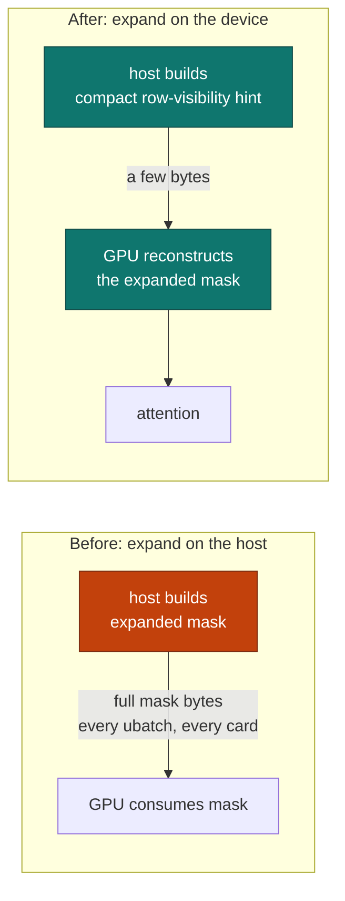
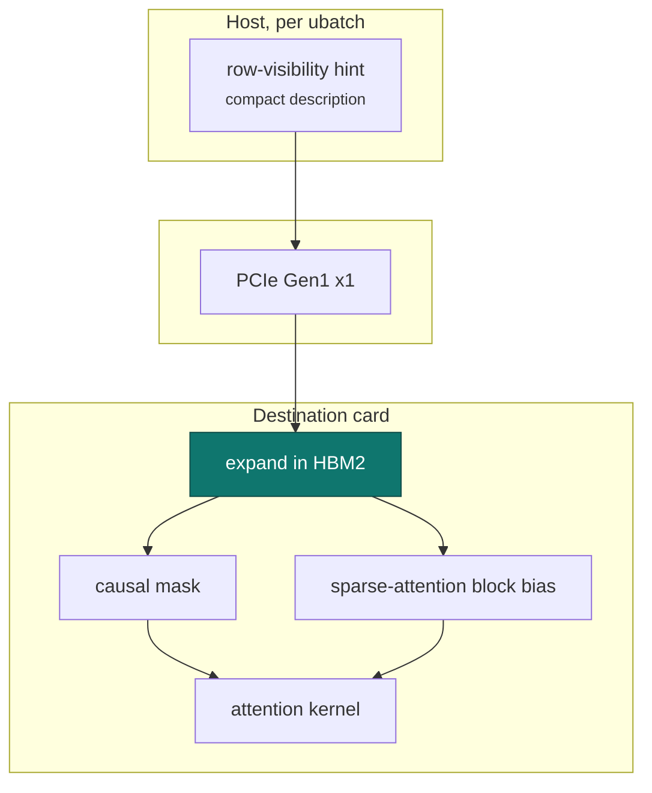

# Device-side mask expansion

!!! abstract "At a glance"

    | | |
    | --- | --- |
    | **Commit** | `a3b834f22` |
    | **Selector** | none; part of the attention path when built |
    | **Aimed at** | per-ubatch mask bytes crossing the link |
    | **Covers** | the causal mask and the sparse-attention block bias |
    | **Output** | byte-for-byte unchanged |

## The problem

Attention masks were uploaded to each card in **expanded** form, on **every**
ubatch. Across a Gen1 x1 link with no peer path, and multiplied by the number of
cards in the split, those bytes are expensive — and they are the most compressible
bytes in the entire pipeline, because an expanded causal mask is almost entirely
derivable from a handful of numbers.

This is the clearest case on the whole project of the general rule: on this
hardware the right move is to **remove** a transfer, not to compress it.

## The mechanism

A compact **row-visibility hint** is published alongside the mask, describing
what each row can see. The destination GPU reconstructs the expanded mask from
that hint, in its own memory, at full HBM2 bandwidth.

The hint travels; the expansion does not. The bytes that used to cross the link
now never leave the card that needs them.

Coverage matters here: the patch handles the **sparse-attention block bias** as
well as the causal mask. A version that covered only the causal mask would leave
the sparse path uploading expanded data and would look like a partial win for
reasons that had nothing to do with the mechanism.

## The safety argument

The reconstructed mask must be the same mask, element for element. It is not
"close enough" — a single wrong element in an attention mask changes which
tokens a row can see, which changes logits, which changes output.

That makes this the patch in the series where byte-exact verification is doing
the most work. The mechanism is retained because the generated tokens are
identical with it and without it at every context in the ladder; nothing weaker
would justify reconstructing a correctness-critical tensor on the far side of a
link.

## What it is not

This does not reduce attention *compute*. The same mask is used by the same
kernel; it simply is not shipped. On a machine with a wide link the mechanism
would be close to free and close to pointless. Its value is entirely a function
of how narrow the link is.

## Scaling

The saving grows with three things at once: context length, ubatch count, and
card count. That is a product, which is why it matters on this machine and would
not be worth the complexity on a single card behind PCIe Gen4 x16.
