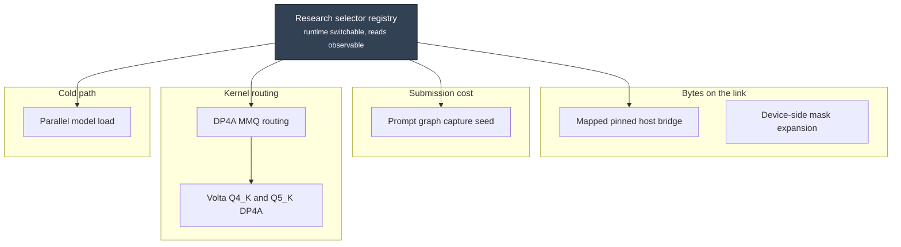

# The patch series

The inherited series contains seven commits on top of a pinned upstream revision: one infrastructure change and six mechanisms. Their descriptions below explain the source; reconstruction of that series is separate from experimental correctness and performance evidence. Subsequently accepted optimizations have their own result entries and patch links.

They are described here in dependency order, which is also the order they were
committed.



## What each one does

| # | Patch | Aimed at | Selector |
| --- | --- | --- | --- |
| 1 | [Research selector registry](research-selectors.md) | Making the other six observable and switchable | — |
| 2 | [DP4A MMQ routing](mmq-dp4a-routing.md) | Prefill matrix multiply routing on SM70 | `--cuda-mmq force` |
| 3 | [Volta Q4_K and Q5_K DP4A](mmq-dp4a-q4k-q5k.md) | The two quantizations the default policy missed | `--cuda-mmq force` |
| 4 | [Parallel model load](parallel-model-load.md) | Cold-start readiness | `LLAMA_MODEL_LOAD_PARALLEL` |
| 5 | [Mapped pinned host bridge](mapped-host-bridge.md) | Cross-card boundaries with no P2P path | `GGML_CUDA_MAPPED_HOST_BRIDGE` |
| 6 | [Prompt graph capture seed](prompt-graph-capture-seed.md) | Driver submission cost during prefill | `GGML_CUDA_PROMPT_GRAPH_CAPTURE_SEED` |
| 7 | [Device-side mask expansion](device-side-mask-expansion.md) | Per-ubatch mask bytes across the link | — |

## Reading a patch page

Each page follows the same shape, so the interesting part is easy to find:

- **The problem** — what the hardware does that makes the default path wrong.
- **The mechanism** — with a diagram of what actually changed.
- **The safety argument** — why output is unchanged. This is the part that
  decides whether a patch is retained.
- **What it is not** — the claim the measurement does *not* support. Several of
  these patches improve prefill and are routinely misread as decode wins.
- **Selector and activation** — how to turn it on, and the log line that proves
  it engaged.

## Applying the series

The patches apply to the pinned upstream revision recorded in each patch header,
and are generated from the commits on `cmp/main` into `cmp/patches/`. Build with
the pinned CUDA container so the result is native SM70:

```bash
cmake -DGGML_CUDA=ON -DCMAKE_CUDA_ARCHITECTURES=70-real
```

The container produces binaries and does not need a GPU. Running them does.

!!! note "Check each patch's activation behavior"

    Some mechanisms use runtime selectors; others change a supported source specialization directly. The result entry describes the affected configurations and any activation evidence. Do not assume every accepted patch is disabled by default.

## Applying the inherited source

The [inherited series manifest](https://github.com/Josephur/llama.cmp-v/tree/main/cmp/releases/inherited) records the upstream base and ordered patches. Reconstruction has been checked independently of runtime performance. New experimental wins still require their own correctness and measurement evidence.

## sm70-d256-shared-q

Human-approved optimization: [SM70 D256 shared Q and unit rescaling preserve output through 250K](../results/2026-09-07-sm70-d256-shared-q.md). The generated source includes this change. Apply [0001-sm70-d256-shared-q.patch](https://github.com/Josephur/llama.cmp-v/blob/main/cmp/patches/0001-sm70-d256-shared-q.patch) to the preceding fork source base; do not apply it twice to the generated source. See the result for exact measurements, regressions and validation limits.
