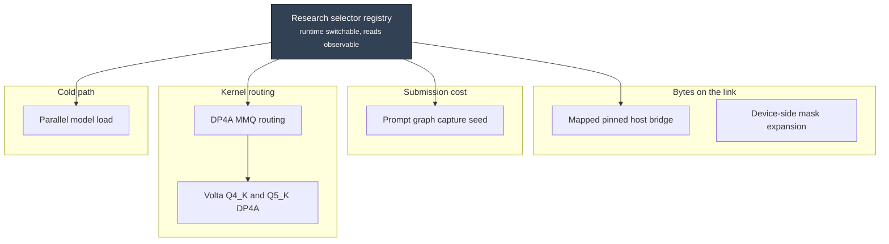

# The patch series

The complete series contains eight patches in one directory: [cmp/patches](https://github.com/Josephur/llama.cmp-v/tree/main/cmp/patches). The single manifest records their application order and upstream base. Every release binary compiles all eight together, and the public source already includes them. Source reconstruction is separate from correctness and performance evidence.

The diagram groups the mechanisms by purpose. Use the manifest for application order.



## What each one does

| # | Patch | Aimed at | Selector |
| --- | --- | --- | --- |
| 1 | [DP4A MMQ routing](mmq-dp4a-routing.md) | Prefill matrix multiply routing on SM70 | `--cuda-mmq force` |
| 2 | [Volta Q4_K and Q5_K DP4A](mmq-dp4a-q4k-q5k.md) | Additional supported SM70 quantizations | `--cuda-mmq force` |
| 3 | [Parallel model load](parallel-model-load.md) | Cold-start readiness | `LLAMA_MODEL_LOAD_PARALLEL` |
| 4 | [Mapped pinned host bridge](mapped-host-bridge.md) | Cross-card boundaries with no P2P path | `GGML_CUDA_MAPPED_HOST_BRIDGE` |
| 5 | [Research selector registry](research-selectors.md) | Runtime policy and selector-read reporting | Per mechanism |
| 6 | [Prompt graph capture seed](prompt-graph-capture-seed.md) | Driver submission cost during prefill | `GGML_CUDA_PROMPT_GRAPH_CAPTURE_SEED` |
| 7 | [Device-side mask expansion](device-side-mask-expansion.md) | Per-ubatch mask transfer volume | None |
| 8 | [SM70 D256 shared Q and unit rescaling](../results/2026-09-07-sm70-d256-shared-q.md) | D256 attention specialization | None |

## Reading a patch page

Each page follows the same shape, so the interesting part is easy to find:

- **The problem** — what the hardware does that makes the default path wrong.
- **The mechanism** — with a diagram of what actually changed.
- **The safety argument** — why output is unchanged. This is the part that
  decides whether a patch is retained.
- **What it is not** — the claim the measurement does *not* support. Several of
  these patches improve prefill and are routinely misread as decode wins.
- **Selector and activation** — how to turn it on, and the log line that proves
  it engaged.

## Complete source and build

The [complete patch directory](https://github.com/Josephur/llama.cmp-v/tree/main/cmp/patches) contains all eight numbered files and [one manifest](https://github.com/Josephur/llama.cmp-v/blob/main/cmp/patches/manifest.json). The first seven mechanisms and the later accepted optimization are not separate release sets. A clone of this fork already has all eight applied.

Build the complete public checkout with CUDA 12.9.2:

```bash
cmake -S . -B build -DGGML_CUDA=ON -DCMAKE_CUDA_ARCHITECTURES=70-real -DGGML_NATIVE=OFF
cmake --build build --parallel 2
```

Some mechanisms use runtime selectors; the D256 source specialization is part of the normal SM70 build. Do not assume every patch is disabled by default. Compilation does not prove runtime activation, GPU correctness or a performance gain.

## Eighth patch: SM70 D256 shared Q and unit rescaling

Human-approved optimization: [SM70 D256 shared Q and unit rescaling preserve output through 250K](../results/2026-09-07-sm70-d256-shared-q.md). The generated source includes this change. Apply [0008-sm70-d256-shared-q.patch](https://github.com/Josephur/llama.cmp-v/blob/main/cmp/patches/0008-sm70-d256-shared-q.patch) to the preceding fork source base; do not apply it twice to the generated source. See the result for exact measurements, regressions and validation limits.
