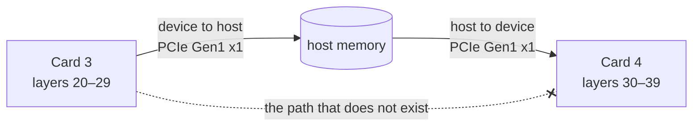
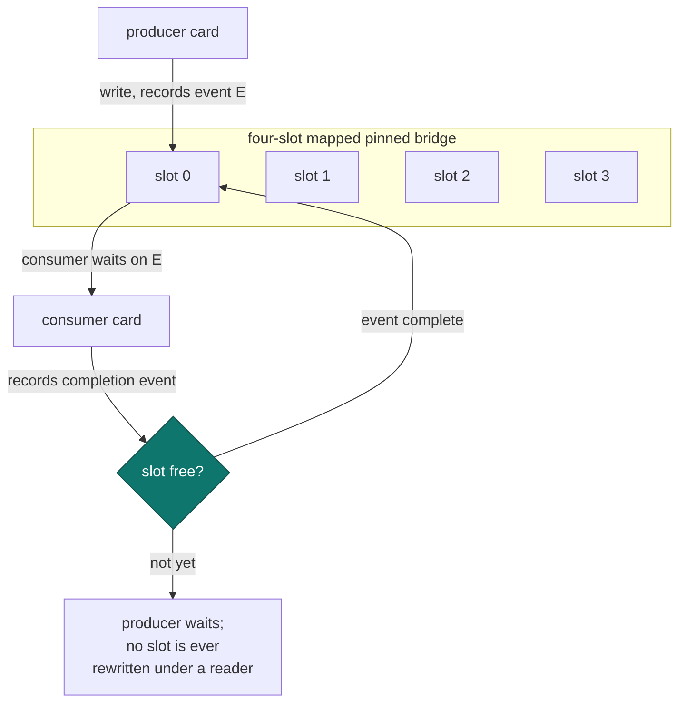

# Mapped pinned host bridge

!!! abstract "At a glance"

    | | |
    | --- | --- |
    | **Commit** | `80b289d94` |
    | **Selector** | `GGML_CUDA_MAPPED_HOST_BRIDGE=1` |
    | **Aimed at** | cross-card tensor boundaries with no peer-to-peer path |
    | **Slots** | four, fixed, for boundaries up to 64 MiB |
    | **Output** | byte-for-byte unchanged, lossless by construction |

## The problem

These cards expose no peer-to-peer path. `cudaDeviceCanAccessPeer` is false for
every pair, there is no NVLink, and the link is PCIe Gen1 x1. So every
cross-card tensor boundary — every point where a layer-split model hands
activations from one card to the next — is a host round trip: down the link,
into host memory, back up the link.

That cost is unavoidable. What *was* avoidable is paying it through an implicit,
per-boundary path the scheduler cannot see, with a fresh staging allocation each
time and no ordering guarantee beyond whatever the surrounding synchronisation
happened to provide.



## The mechanism

Two parts.

**Scheduler-visible CUDA ownership.** The boundary becomes something the graph
scheduler knows about rather than an implicit copy hidden inside a backend
call. What is staged, when, and who is waiting on it are all explicit.

**A fixed four-slot mapped pinned bridge.** Staging buffers are mapped pinned
host memory, allocated once, reused, and sized for boundaries up to 64 MiB.
Reuse is ordered by CUDA events, so a slot is never rewritten while a consumer
is still reading it.



Four slots, not a queue that grows: a fixed pool bounds pinned host memory, and
pinned memory on a host feeding six cards is a resource worth bounding. When all
four are in flight the producer waits, which is the correct behaviour on a link
that is already the bottleneck.

## The safety argument

!!! success "Lossless by construction"

    This patch changes **where bytes are staged, not what they contain**. No
    transformation, no compression, no precision change. The only correctness
    question is ordering, and ordering is enforced by CUDA events rather than by
    assumption: a slot is reusable only after the event marking its consumer's
    completion has fired.

That is a much stronger position than "we measured the same output". Byte-exact
verification across the ladder confirms it, but the argument does not depend on
the measurement.

## What it is not

This does not remove the host round trip. It cannot — there is no peer path to
route around it. It makes the round trip explicit, bounded and reusable. On a
single-card configuration there are no cross-card boundaries and the mechanism
has nothing to do.

## Enabling it

```bash
GGML_CUDA_MAPPED_HOST_BRIDGE=1 llama-server ...
```

Confirm the bridge's own log line reports the slot count. A selector read
through the [research registry](research-selectors.md) proves only that the
value was seen.
