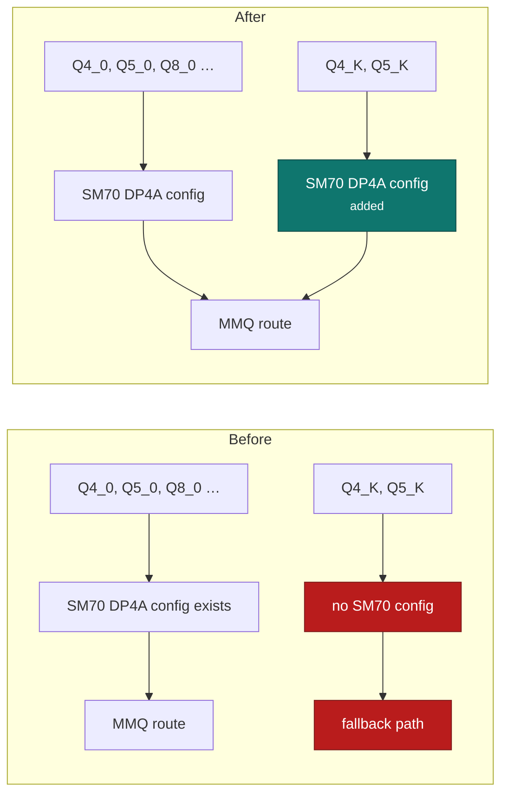

# Volta Q4_K and Q5_K DP4A

!!! abstract "At a glance"

    | | |
    | --- | --- |
    | **Commit** | `fe6c8d862` |
    | **Selector** | `--cuda-mmq force` |
    | **Aimed at** | Q4_K and Q5_K matrix-vector shapes on SM70 |
    | **Measured** | +33.7% at a 4K prompt; +0.09% at an exact 100K prompt |
    | **Output** | byte-for-byte unchanged |

## The problem

[Forcing the DP4A route](mmq-dp4a-routing.md) only helps where a DP4A
configuration exists. The default MMQ configuration selection on SM70 did not
cover **Q4_K** and **Q5_K** — two of the most commonly used k-quantizations —
so those types fell back regardless of what the routing flag asked for.

Shape instrumentation is what found it. Instrumenting the dispatcher and
counting what actually ran showed the majority of measured matrix-vector work
using grouped shapes that these two quantizations serve. The gap was invisible
from the flag's point of view: the selector was honoured, and the types it could
not reach simply took the other path.



## The mechanism

Adds the missing SM70 MMQ configurations for Q4_K and Q5_K so the DP4A route is
reachable for those types, using the grouped shapes the instrumentation showed
dominating real work.

The instrumentation itself is worth naming as a method, not just a step: on a
card with no profiler, counting dispatches by shape and type is the substitute
for a kernel timeline. It is how a routing gap that looks like nothing from
outside becomes a specific missing table entry.

## The safety argument

Same argument as the parent patch, and it applies unchanged: a different kernel
computing the same product, verified byte-for-byte against the unforced route at
every context in the ladder.

## What it is not

!!! warning "A short-context win, and it is not represented as anything else"

    The effect is **strongly context-dependent**:

    | Prompt context | Change |
    | --- | --- |
    | 4K | **+33.7%** |
    | exact 100K | **+0.09%** |

    That is not a range, it is a decay. Quoting the 4K figure without the 100K
    figure would be a lie by omission, and the reason both appear here is that
    somebody reading only the first number would reasonably expect a third of
    their long-context prefill back and not get it.

Why the decay? At short context the matrix-vector work this patch reaches is a
large share of the total. At 100K the wall clock is dominated by other costs —
transport, mask uploads, submission — and a faster kernel on a small share of
the work moves almost nothing. It is the same reason the rest of this series is
about scheduling and bytes rather than arithmetic.

## Enabling it

The same flag as the parent patch:

```bash
llama-server --cuda-mmq force ...
```

There is no separate selector. The types are either reachable in the
configuration table or they are not.
