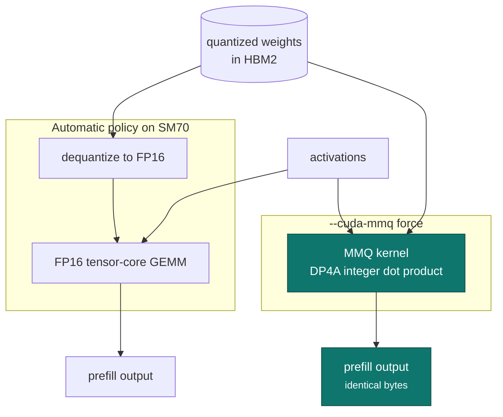

# DP4A MMQ routing

!!! abstract "At a glance"

    | | |
    | --- | --- |
    | **Commit** | `58b367ac5` |
    | **Selector** | `--cuda-mmq force` |
    | **Aimed at** | quantized prefill matrix multiply |
    | **Measured** | 2.36&times; matched prefill throughput at 128K, one six-card configuration |
    | **Output** | byte-for-byte unchanged |

## The problem

llama.cpp chooses between two routes for a quantized matrix multiply: dequantize
and use the FP16 tensor-core path, or keep the weights quantized and use the
integer dot-product (DP4A) MMQ kernels. The automatic policy makes that choice
from architecture and shape heuristics tuned across the whole GPU line-up.

On Volta, for the prefill shapes this project actually runs, that policy picks
the generic FP16 tensor-core path — and on these cards it is the wrong pick.
SM70 has full DP4A support and the MMQ route avoids materialising dequantized
weights, which matters more here than on a card with a wide link and spare
bandwidth.

The result is a route chosen for a fleet, applied to a card that is not
representative of that fleet.



## The mechanism

A runtime selection that forces the DP4A MMQ route, so it can be compared
against the automatic policy rather than argued about. The argument parser gained
focused coverage for the flag, because a routing flag that silently fails to
parse is the worst possible failure mode: the run completes, the numbers move a
little, and the conclusion is wrong.

The patch adds **one** command-line flag. It is the only CLI surface this whole
series adds; every other flag used in the benchmark harness is upstream's.

## The safety argument

MMQ and the dequantize-then-GEMM path compute the same product. This is a
routing change, not a numerics change: the accumulation order within a kernel is
fixed by that kernel, and the comparison is run with the same kernel on both
sides of every reference.

Byte-for-byte identity was verified across the ladder, which is why the patch is
retained. A routing change that produced *nearly* identical logits would have
been rejected.

## What it is not

!!! warning "This is a prefill result, not a decode result"

    One six-card configuration measured **2.36&times;** matched prefill
    throughput at 128K against its automatic policy. Batch-one decode follows a
    different code path — MMVQ, matrix-vector rather than matrix-matrix — with
    different behaviour. No decode gain is claimed from this patch, and the
    measured prefill figure must not be quoted as a token-generation figure.

The gain is also configuration-dependent. It was measured on one six-card
configuration at one context with one quantization. Other shapes are covered by
[the Q4_K and Q5_K follow-up](mmq-dp4a-q4k-q5k.md), which found the effect
strongly context-dependent.

## Enabling it

```bash
llama-server --cuda-mmq force ...
```

Confirm from the run log that the MMQ route was taken. A flag accepted is not a
route changed; see [Method](../method.md#activation-is-proved-not-assumed).
