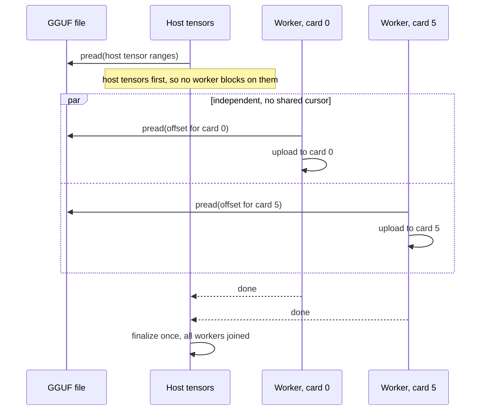

# Parallel model load

!!! abstract "At a glance"

    | | |
    | --- | --- |
    | **Commit** | `e0a73d179` |
    | **Selector** | `LLAMA_MODEL_LOAD_PARALLEL=1` |
    | **Aimed at** | cold-start readiness |
    | **Measured** | 51–59% faster against matched controls |
    | **Output** | byte-for-byte unchanged |
    | **Eligibility** | only without mmap, direct I/O, or tensor checking |

## The problem

Model load walked backend contexts one at a time, sharing a single file offset.
With one GPU that is fine: the link is the bottleneck and there is one link.
With six GPUs it is a serialisation that has no reason to exist — the uploads
are independent, they target different devices, and the only thing binding them
together is a shared read cursor in the loader.

On PCIe Gen1 x1 a cold load is not a rounding error. It is minutes, and it is
paid again on every restart and every A/B run that cannot share a loaded model.

```mermaid
gantt
    dateFormat X
    axisFormat %s
    title Serial versus overlapped upload, six cards

    section Serial
    card 0 :done, s0, 0, 6
    card 1 :done, s1, 6, 6
    card 2 :done, s2, 12, 6
    card 3 :done, s3, 18, 6
    card 4 :done, s4, 24, 6
    card 5 :done, s5, 30, 6

    section Overlapped
    host tensors first :active, h, 0, 3
    card 0 :active, p0, 3, 12
    card 1 :active, p1, 3, 12
    card 2 :active, p2, 3, 12
    card 3 :active, p3, 3, 12
    card 4 :active, p4, 3, 12
    card 5 :active, p5, 3, 12
```



## The mechanism

Three changes together:

1. **Positional reads.** Each worker reads from its own offset rather than
   advancing a shared cursor, which is what made the walk serial in the first
   place.
2. **One upload worker per GPU.** Independent backend contexts upload
   concurrently. Host tensors are loaded first, so a worker never waits on
   something the host has not produced yet.
3. **Synchronized progress reporting and finalization.** Progress output stays
   coherent with several workers running, and finalization happens once, after
   all of them.



## The safety argument

The bytes written to each device are the same bytes, read from the same file, at
the same offsets. Only the order in which independent regions are read and the
concurrency of the uploads change. Nothing is transformed in flight.

Eligibility is restricted deliberately: the path is available **only** when mmap
is off, direct I/O is off, and tensor checking is off. Each of those three
either owns the read path itself or requires a deterministic single-threaded
walk to do its job, and rather than teach the parallel loader to coexist with
them, it declines to run.

## What it is not

!!! warning "A cold-path result, reported separately"

    51–59% is **model load time**, measured against matched controls. It is not
    a token-generation gain and does not appear in any throughput figure on this
    site. Model load is reported as its own metric precisely so it cannot be
    added to one.

It also does nothing for a single-card configuration, where there was no
serialisation to remove.

## Enabling it

```bash
LLAMA_MODEL_LOAD_PARALLEL=1 llama-server --load-mode read ...
```

If mmap, direct I/O or tensor checking is active the selector is read and the
path declines. That is a case where the selector is genuinely read and the
mechanism genuinely does not run, which is why the log line and not the variable
is the evidence.
