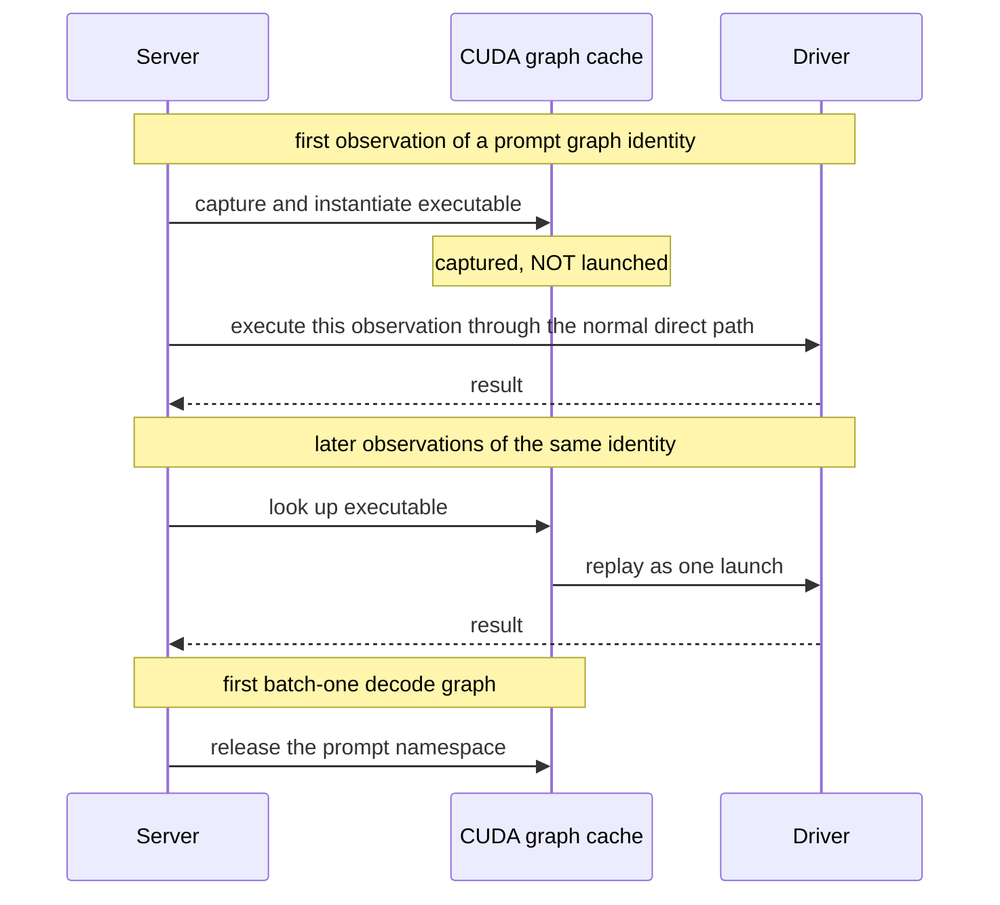
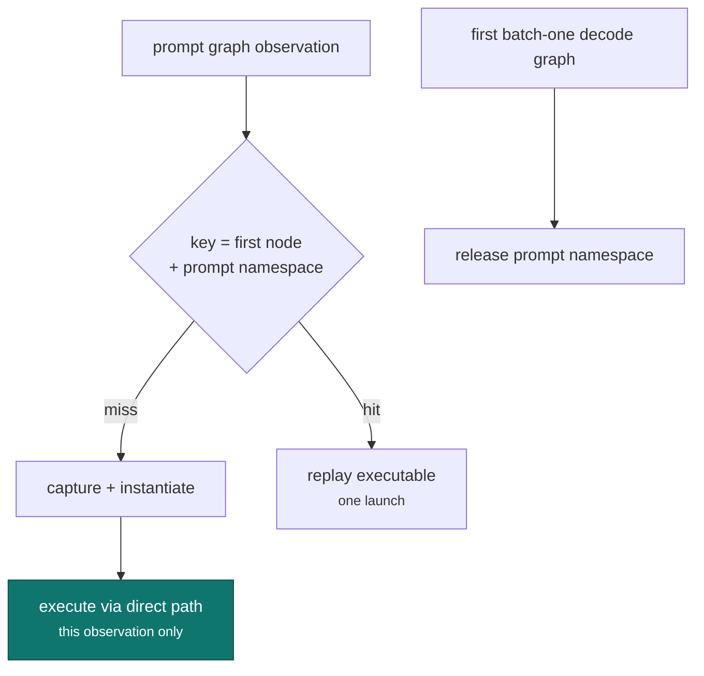

# Prompt graph capture seed

!!! abstract "At a glance"

    | | |
    | --- | --- |
    | **Commit** | `49e794dbc` |
    | **Selector** | `GGML_CUDA_PROMPT_GRAPH_CAPTURE_SEED=1` |
    | **Aimed at** | driver submission cost during prefill |
    | **Measured** | a large multiple of prompt throughput on one model family; a few percent on another; a small batch-one decode cost |
    | **Output** | byte-for-byte unchanged |

## The problem

The prompt path submitted every compatible graph directly, from a single host
thread. Attribution placed the large majority of sampled server CPU cycles
inside **driver submission** rather than arithmetic.

On a saturated node that would not matter much; submission overlaps with GPUs
that are busy. Here the cards are mostly idle and the link is narrow, so
submission is not hidden behind anything. It *is* the wall clock.

CUDA graphs are the standard answer: capture the submission pattern once, replay
it as one launch. The difficulty is that capturing and replaying a graph whose
first execution has not been proven is exactly how a subtle corruption gets
introduced, and this project's correctness bar leaves no room for that.

## The mechanism

The ordering is the whole design.



On the **first** observation of a prompt graph identity, an executable is
captured and instantiated — and deliberately **not launched**. That same
observation still executes through the normal direct path. Only *later*
observations replay.

!!! success "The safety property, stated plainly"

    A mutable first observation is never replayed from an unproven executable.
    The first pass through any graph identity takes the ordinary path; the
    captured executable is only ever used for a repeat of a shape that has
    already executed correctly once.

Two more details that turned out to matter:

**Prompt graphs use their own namespace,** separate from decode graphs, and the
prompt entries are released at the first batch-one decode graph. Prefill and
decode have different shapes and different lifetimes; sharing a cache between
them means one evicts the other at exactly the wrong moment.

**Executables are keyed by first node and prompt namespace, not by source
address.** Address-keyed caching fragmented badly at long context — the same
logical graph arrived at a different address and missed the cache, which is the
failure mode where a graph cache appears to work and quietly never hits.



## What it is not

!!! warning "Strongly configuration-dependent, and not a decode gain"

    One tested model family gained a large multiple of its prompt throughput.
    Another gained a few percent. One configuration showed a **small batch-one
    decode cost**.

    No decode gain is claimed. A mechanism that helps prefill enormously and
    costs decode slightly is still worth having on a prefill-bound workload, but
    only if both halves are stated. The entries in the
    [timeline](../results/index.md) carry the per-configuration numbers.

The spread between model families is not noise; it reflects how much of a given
model's prompt path is submission-bound in the first place. A model whose graph
is a few large nodes has little submission cost to remove.

## Enabling it

```bash
GGML_CUDA_PROMPT_GRAPH_CAPTURE_SEED=1 llama-server ...
```

Confirm from the log that executables were instantiated *and* that later
observations replayed. A cache that captures and never hits is the exact failure
the address-keying change was made to fix, and it looks like success from
outside.
