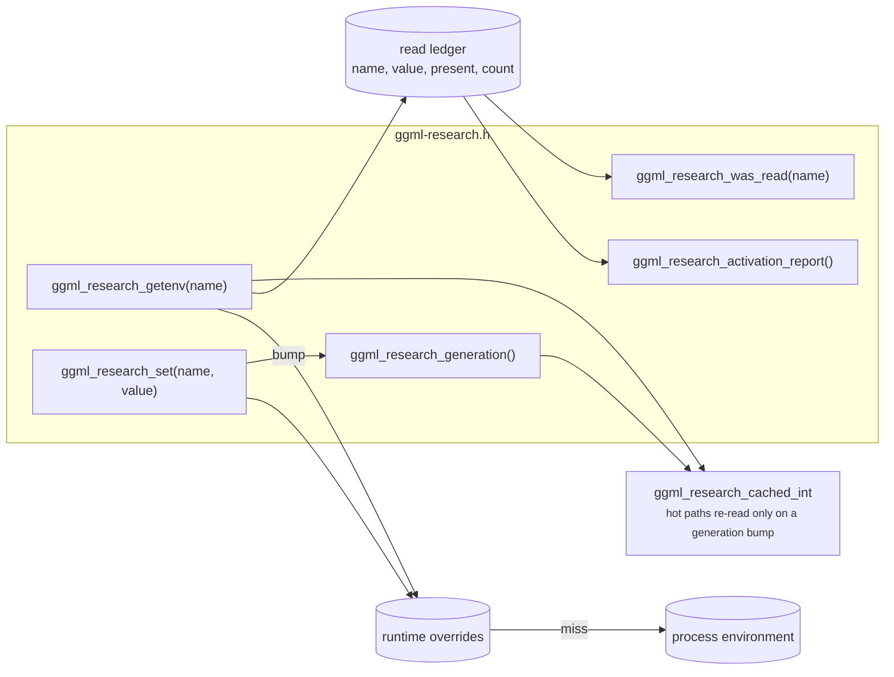

# Research selector registry

!!! abstract "At a glance"

    | | |
    | --- | --- |
    | **Commit** | `738880fc7` |
    | **Selector** | none; this *is* the selector mechanism |
    | **Header** | `ggml/include/ggml-research.h` |
    | **Behaviour change** | none on its own |
    | **Output** | unchanged by construction |

## The problem

Research selectors in this fork started as plain environment variables read once
at process start. That has two consequences, and the second one is expensive.

**You cannot A/B on a loaded model.** Comparing two variants meant reloading the
model between arms. On these cards a cold load is minutes of PCIe Gen1 x1
traffic, so every comparison paid for itself twice and drifted in between.

**A selector whose implementation disappears goes completely silent.** Nothing
reads an unknown environment variable, so nothing complains. Same-package A/B
testing cannot detect it either, because *both arms are missing the same code*.
The deployment sets the variable, both arms produce identical numbers, and the
correct conclusion — "this optimization does nothing" — is indistinguishable
from "this optimization is gone".

!!! failure "This is not hypothetical"

    A rebase dropped a family of mechanisms. The service unit kept setting their
    variables. For three weeks the deployment believed eleven optimizations were
    enabled and none of them existed in the binary. Nothing in the system was
    capable of noticing.

## The mechanism

One header and one source file, using `GGML_API` from `ggml.h` so the registry
is exported from shared libraries on Windows as well as Linux. Every read is recorded.



Three properties matter:

1. **An override beats the environment.** `ggml_research_set()` lets a running
   process switch a variant between requests, so both arms of a comparison can
   share one loaded model.
2. **Every read is counted.** The report is a JSON object listing each selector
   name, its value, whether a value existed at first read, and how many times it
   was read. A selector a deployment sets but no surviving code reads becomes
   *detectable* rather than invisible.
3. **Hot paths do not pay for it.** `ggml_research_cached_int` caches the value
   and re-reads only when the generation counter moves, so a per-node check does
   not take a registry lock.

```c
static ggml_research_cached_int sel;
if (sel.get("GGML_CUDA_SOMETHING", 0)) {
    // ...
}
```

## Where a selector must be read

This is the rule that the registry exists to make enforceable.

=== "Correct"

    The selector is read **at the point where the decision is made**, in the
    same branch that does the work.

    ```mermaid
    flowchart LR
        A["dispatch"] --> B{"sel.get(...)"}
        B -- "1" --> C["mechanism runs<br/>and logs that it ran"]
        B -- "0" --> D["upstream path"]
    ```

=== "Wrong, and it passes the activation check"

    The selector is read in a setup function while the branch that would act on
    it reads the environment directly, or no longer exists. The registry
    faithfully reports the read. Nothing happens.

    ```mermaid
    flowchart LR
        A["init"] --> B["sel.get(...)<br/><small>recorded as read</small>"]
        C["dispatch"] --> D["upstream path only"]
        B -.->|"no connection"| D
    ```

!!! warning "Selector-was-read is not proof of activation"

    It is necessary, not sufficient. A result on this project is accepted only
    when the mechanism's own log line proves it engaged. See
    [Method](../method.md#activation-is-proved-not-assumed).

## What it is not

This patch changes no behaviour on its own and claims no performance delta. It
is infrastructure the later patches are read through. Its value is entirely in
what it makes *observable*.

## Verifying it

Every selector read through the header appears in the activation report:

```json
{"read":[{"name":"GGML_CUDA_MAPPED_HOST_BRIDGE","value":"1","present":1,"reads":812}]}
```

A selector set in the deployment but absent from this list is not enabled. It is
missing.
