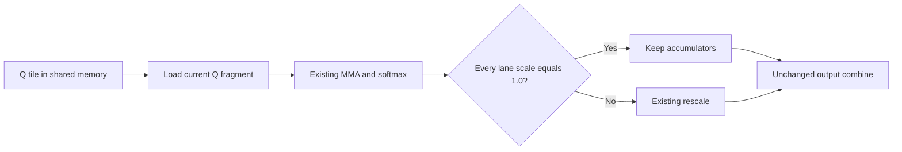

# SM70 D256 shared Q and unit rescaling

The combined shared-Q and unit-rescale patch was accepted after review of its gains, regressions and measurement limits. All four primary contexts preserved exact 256-token output. At 250K, observed request wall time was 2.677% lower than the original saved reference. These single samples do not establish statistical repeatability or native kernel attribution.

## Mechanism

For the Volta DKQ=DV=256, 64-column attention configuration, keep the Q tile in shared memory and load one fragment per MMA step. The refinement skips the existing output-accumulator rescale only when every warp lane's scale is exactly 1.0. The fallback retains the existing multiplication.

MMA order, row-sum arithmetic, barriers, tile ownership, shared allocation and Stream-K partition remain unchanged. The inherited MMQ routing, mapped staging, prompt graph and mask-expansion patches remain in the source series. There is no runtime selector for this specialization.

The original shared-Q change reduced the compiled D256 16x4 stack from 472 to 48 bytes per thread. The unit-rescale refinement increased it to 64 bytes, with registers remaining at 255. Static local stores increased from 97 to 100; local loads remained 74. Dynamic shared allocation remains 67,584 bytes, limiting the block residency in this configuration.

## Native CMP measurements

The six-card primary workload completed 8,192, 65,536, 131,072 and 250,000 prompt tokens, using server capacities 8,448, 66,048, 131,328 and 250,368. Every response completed with exactly 256 generated tokens and matched the saved reference byte-for-byte. Tokenized requests and responses also matched the first shared-Q candidate. The public model label is `primary`; it is not a complete model fingerprint.

The following table compares the accepted combined patch with the original saved reference. Negative duration changes mean faster execution; positive throughput changes mean faster execution.

| model | context | devices | server context | tokens | metric | unit | reference | candidate | change pct |
|---|---|---|---|---|---|---|---|---|---|
| primary | 8192 | 6 | 8448 | 256 | request wall time | seconds | 49.18146054099634 | 49.025936158999684 | -0.316225627067368 |
| primary | 8192 | 6 | 8448 | 256 | prompt processing time | seconds | 39.381001 | 39.21664 | -0.4173611534150634 |
| primary | 8192 | 6 | 8448 | 256 | generation time | seconds | 9.779947 | 9.787914 | 0.08146260915320447 |
| primary | 8192 | 6 | 8448 | 256 | prompt throughput | tokens/second | 208.0190902206879 | 208.89091977283113 | 0.4191103572360966 |
| primary | 8192 | 6 | 8448 | 256 | generation throughput | tokens/second | 26.07376093142427 | 26.0525378543375 | -0.08139630160216571 |
| primary | 65536 | 6 | 66048 | 256 | request wall time | seconds | 436.4602168650017 | 430.4098335890012 | -1.3862393506237747 |
| primary | 65536 | 6 | 66048 | 256 | prompt processing time | seconds | 422.672656 | 416.28685600000006 | -1.5108145533786255 |
| primary | 65536 | 6 | 66048 | 256 | generation time | seconds | 13.689718000000001 | 14.029577999999999 | 2.482593140340783 |
| primary | 65536 | 6 | 66048 | 256 | prompt throughput | tokens/second | 155.05143062767704 | 157.4299045367889 | 1.5339903021103218 |
| primary | 65536 | 6 | 66048 | 256 | generation throughput | tokens/second | 18.62711854254412 | 18.17588526183753 | -2.4224534765051375 |
| primary | 131072 | 6 | 131328 | 256 | request wall time | seconds | 1148.3284944879997 | 1123.5065556100017 | -2.1615712748698557 |
| primary | 131072 | 6 | 131328 | 256 | prompt processing time | seconds | 1128.218657 | 1103.5812649999998 | -2.1837426501625457 |
| primary | 131072 | 6 | 131328 | 256 | generation time | seconds | 19.927562 | 19.744818 | -0.9170414323638965 |
| primary | 131072 | 6 | 131328 | 256 | prompt throughput | tokens/second | 116.17606142813504 | 118.76968571045832 | 2.2324945866129653 |
| primary | 131072 | 6 | 131328 | 256 | generation throughput | tokens/second | 12.796347089523545 | 12.914780982027791 | 0.9255289159920466 |
| primary | 250000 | 6 | 250368 | 256 | request wall time | seconds | 3231.6576527600046 | 3145.1590241910017 | -2.6766024704110714 |
| primary | 250000 | 6 | 250368 | 256 | prompt processing time | seconds | 3179.024368 | 3092.856799 | -2.7105035704463543 |
| primary | 250000 | 6 | 250368 | 256 | generation time | seconds | 52.297720999999996 | 51.965493 | -0.6352628635576507 |
| primary | 250000 | 6 | 250368 | 256 | prompt throughput | tokens/second | 78.64047929814421 | 80.83141776264307 | 2.7860187069721487 |
| primary | 250000 | 6 | 250368 | 256 | generation throughput | tokens/second | 4.875929488399695 | 4.907102488183841 | 0.6393242531154142 |

[Download `sm70-d256-shared-q-promotion.csv`](data/sm70-d256-shared-q-promotion.csv){ .cmp-data-link download }

At 250K, the total saving was 86.499 seconds against the original reference. Only 2.304 seconds was incremental to the first shared-Q candidate. Relative to that first candidate, wall time changed by +0.065%, -0.030%, +0.025% and -0.073% across the four contexts. These differences are small and mixed.

## Regressions and limits

- Generation slowed at every context relative to the first shared-Q candidate: +0.484%, +1.384%, +0.785% and +0.762%.
- Against the original reference, generation regressed at 8K (+0.081%) and 65K (+2.483%). Prefill also regressed slightly at 131K relative to the first candidate.
- Stack allocation and static local stores increased with the unit-rescale guard.
- Each primary context was measured once against saved references. Thermal, runtime and cache drift were not controlled by a fresh alternating comparison.
- Historical baseline model-file metadata was incomplete. Matching requests and responses does not reconstruct that missing identity.
- The measured candidates were research snapshots. Promotion matched the accepted engine source to a committed rebuild; this does not retroactively change the original build provenance or establish selector attribution.

## Diagnostic evidence

On a physically modified CMP reporting V100, three selected D256 32x2 prefill kernels averaged 2.199467 ms before the refinement and 2.088928 ms after it, a 5.026% reduction. Each capture used 12 replay passes. Different firmware, exposed resources, PCIe configuration, model and attention shape prevent interpreting that result as a native-CMP speedup estimate. It is not a factory V100 comparison.

No branch-hit count or source-instruction timing was collected. Profiler timing was excluded from native performance acceptance. At 250K, sampled mean per-card native prefill GPU activity remained approximately 16-21%; coarse utilization is not occupancy or proof of simultaneous activity. No PCIe saturation or repeatable traffic reduction is established.

## Source and measurement records

- [Accepted source patch](https://github.com/Josephur/llama.cmp-v/blob/main/cmp/patches/0008-sm70-d256-shared-q.patch)
- [Original shared-Q measurements](data/sm70-d256-shared-q-20260907.csv)
- [Four-step unroll comparison, not adopted](data/sm70-d256-shared-q-unroll4-20260907.csv)
- [Unit-rescale measurements with both comparison denominators](data/sm70-d256-shared-q-unit-scale-20260907.csv)
- [Promotion measurements](data/sm70-d256-shared-q-promotion.csv)
- [Acceptance and provenance record](data/sm70-d256-shared-q-promotion.json)

Human acceptance records the decision to retain this tradeoff. It does not establish statistical significance, exhaustive numerical correctness, or a general performance guarantee.
