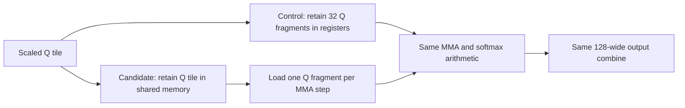
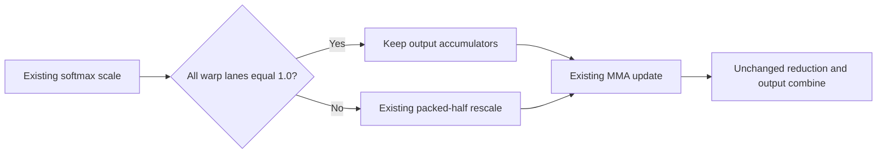

# SM70 D256 shared Q and unit rescaling

The user approved the combined shared-Q and unit-rescale candidate as a modestly helpful patch. All four primary contexts preserved exact 256-token output. At 250K, request wall time was 2.677% lower than the original saved reference, saving 86.499 seconds; 2.304 seconds of that saving was incremental to the first shared-Q candidate. Generation regressed at 8K and 65K against the original reference and at every context against the first candidate. Native repeatability and selector attribution remain unproven. The indexed headline now describes the combined candidate; the original measurements below remain unchanged historical evidence.

## Original shared-Q measurements (historical)

The existing shared-Q implementation reduced the compiled D256 16x4 kernel stack from 472 to 48 bytes per thread. All four configured primary contexts preserved byte-exact output. Observed request wall time fell by 0.38% at 8K and 2.61% at 250K against saved references. Generation at 65K regressed by 1.08%. The result remains inconclusive for optimization acceptance because this comparison does not establish runtime selector attribution or repeatability.

## Mechanism

One Volta configuration entry selects `Q_in_reg = false` for DKQ=DV=256 and 64 columns. It uses the existing fragment-loading path. The complete Q tile stays in shared memory; one Q fragment is loaded for the current MMA step. The other configuration values, input conversion and scaling, per-accumulator K order, KV batch, warp ownership, combine width and launcher remain unchanged. Other architectures and column counts retain their prior configuration.

For the 16x4 shape, shared Q, KV and mask require 33,792 + 16,896 + 1,280 = 51,968 bytes. The unchanged combine allocation remains larger at 67,584 bytes. Even the 64x1 mask fits below that allocation. The launch therefore remains limited to one block per SM by Volta's 96 KiB shared-memory capacity. Lower register pressure cannot change the occupancy-based Stream-K partition in this experiment. This avoids the ownership change that invalidated earlier reduced-combine attempts.

The hypothesis was that fewer spills would offset repeated shared-memory fragment loads. This independently tests an existing implementation choice; it does not port the historical streamed-global-Q/three-block candidate. NVIDIA's [Volta tuning guide](https://docs.nvidia.com/cuda/volta-tuning-guide/index.html#occupancy) documents the register and shared-memory limits behind this tradeoff.

## Compiled evidence

The managed CUDA 12.9.2 native-SM70 build succeeded. The non-softcap D256 16x4 specialization changed as follows:

| Resource or static instruction count | Installed control | Candidate |
| --- | ---: | ---: |
| Registers per thread | 255 | 255 |
| Stack bytes per thread | 472 | 48 |
| Local loads / stores | 512 / 516 | 74 / 97 |
| Shared loads / stores | 1,332 / 237 | 1,428 / 237 |
| HMMA instructions | 4,608 | 4,608 |
| Total instructions | 11,892 | 11,096 |

FFMA, FADD and FMUL counts also remained unchanged. These are static instruction sites, not executed instruction counts or isolated-kernel timings. Equal arithmetic counts alone do not prove exactness. The resource tool's static shared-memory field is zero; the dynamic allocation above comes from the launch calculation.

## Correctness

Managed compare mode measured the existing candidate once at each configured primary context. The completed 8K result was reused; the explicitly authorized partial continuation covered only 65,536, 131,072 and 250,000 prompt tokens. Each tokenized request matched its saved reference and the toolkit's byte-exact response comparison passed with exactly 256 generated tokens. Configured server contexts were 8,448, 66,048, 131,328 and 250,368 respectively. No output check was relaxed.

The baseline selection retained in private run material supplied the September 6 references from source revision `701ddcb6a`: one saved run covers the first three contexts and a second covers 250K. Candidate runs reuse the same immutable dirty research package built from revision `426122a8a` plus the configuration change. The continuation used `--completion-only --mode compare --allow-dirty` after dry-run inspection. It did not rebuild, repeat 8K, repeat reference benchmarks or start the full optimization sequence. The configured 80-minute request timeout was used for the continuation, including 250K.

## Performance

Negative time changes mean shorter duration. These non-streaming request measurements are not TTFT. The [verified measurement CSV](data/sm70-d256-shared-q-20260907.csv) contains absolute durations, throughput, signed changes, model label, six-card count, server contexts and upstream base for all four contexts. Private package and source-tree identities remain in the retained audit receipts.

| Prompt tokens | Saved wall, s | Candidate wall, s | Wall change | Prefill change | Generation change |
| --- | ---: | ---: | ---: | ---: | ---: |
| 8,192 | 49.181461 | 48.994302 | -0.381% | -0.369% | -0.401% |
| 65,536 | 436.460217 | 430.539636 | -1.356% | -1.436% | +1.084% |
| 131,072 | 1148.328494 | 1123.228128 | -2.186% | -2.195% | -1.689% |
| 250,000 | 3231.657653 | 3147.463190 | -2.605% | -2.626% | -1.387% |

At 250K, wall time was 84.194 seconds shorter. Prefill fell from 3,179.024 to 3,095.552 seconds and generation from 52.298 to 51.572 seconds. The observed long-context differences warrant retaining the candidate for review; a small 8K gain is not a gate for testing larger contexts. One candidate sample per context against saved references cannot establish statistical significance or causality.

## Regressions

At 65,536 tokens, generation increased from 13.689718 to 13.838106 seconds, a 1.084% regression; generation throughput fell by 1.072%. Prefill and total request wall time improved at that context. No other measured timing component regressed. The single-card regression test is outside this explicitly authorized partial continuation and remains unvalidated.

## Telemetry

All candidate and reference telemetry summaries were complete and uncapped, with no reported collector errors, missing devices or missing sensors. Metrics-counter boundaries were valid. During prefill, process CPU averaged approximately one core; candidate process peak RSS ranged from 1,392 to 2,149 MiB, close to the corresponding references, with approximately 214-215 MiB of process swap. These process measurements exclude GPU memory and host page cache.

| Prompt tokens | Mean per-card SM clock range, reference / candidate MHz | Peak GPU temperature, reference / candidate C | Summed mean PCIe RX/TX, reference / candidate MB/s |
| --- | --- | --- | --- |
| 8,192 | 1362-1374 / 1362-1374 | 42 / 40 | 245.4/158.1 / 213.6/88.9 |
| 65,536 | 1375-1378 / 1376-1377 | 43 / 43 | 133.4/96.3 / 144.4/112.0 |
| 131,072 | 1372-1375 / 1372-1374 | 44 / 43 | 111.0/74.6 / 108.0/71.1 |
| 250,000 | 1364-1367 / 1365-1368 | 45 / 43 | 58.8/48.4 / 57.9/47.5 |

Clock settings were unchanged. Similar sampled clocks do not eliminate runtime drift. Traffic rose at 65K and fell at the other contexts; these observations do not establish a repeatable traffic reduction or PCIe saturation. At 250K, per-card mean prefill GPU utilization was approximately 16-21% in both runs; coarse utilization is not an occupancy measurement.

## Validation limits

The candidate is an uncommitted research snapshot. Completion-only comparison checks saved output and timing but does not prove D256 runtime activation or isolate its latency. Historical model file sizes and modification times were absent, so model-file continuity remains unverified despite matching tokenized requests and responses. The engine source at the saved-reference revision matches the candidate's base HEAD; this configuration change is the only engine-source difference. Runtime and thermal drift remain uncontrolled, and no fresh paired comparison was run.

Private build provenance, disassembly, exact job identities, recovery journals, raw responses and the combined measurements remain in ignored run material. At the original close-out, no acceptance-evidence file or public patch was generated. The selector-attribution preparer requires committed source and execution evidence. A separate human-promotion workflow now permits explicit acceptance of the documented comparison limits after matching a clean rebuild to the measured source. The source remains reviewable and uncommitted, with no promotion or publication.

## Recovery

Both candidate jobs passed and completed managed recovery. Their journals record `restored`, their outcomes record `passed` with restoration, and their benchmark units stopped successfully. Final observation on September 7 at 3:49 a.m. EDT verified the original production package and marker, its active and enabled service, and production ownership of all six selected GPUs. Recovery validated service health and a completed generation request. Full raw evidence for both candidate jobs was copied and verified locally without compacting target runs. The existing Observatory tab was retained throughout the continuation, with five-minute observations of the exact dispatched job monitored by GPT Luna.

## Local validation

The nine workflow tests and 65 managed-workflow tests passed after the toolkit repairs. The repaired navigation also passed the strict documentation build. The final results-index check, strict documentation preview, target audit and workspace audit all passed. Successful GPU measurements were retained without repetition.

## Human disposition

continue-testing: The user requested another optimization pass on the existing shared-Q candidate and asked for retained telemetry analysis. Continue the same experiment with a focused loop-unrolling refinement; preserve prior measurements and leave changes uncommitted.

## Close-out audit

The original four comparisons were independently rechecked against retained requests, responses, timings and archive receipts. The linked CSV contains 20 absolute measurement rows, and all 12 duration deltas are indexed. The audit also found and disarmed an obsolete recovery timer from an earlier restored rehearsal; the candidate jobs had already restored production correctly. Full evidence, candidate packages and prior production packages remain retained for review and recovery.

The repaired tooling passed 19 local workflow tests and 70 managed-workflow tests. An isolated preview of this measured candidate passed privacy checks and a strict public portal build. These are tooling and preview checks, not a permanent deployment or publication. Later source refinements require their own matching evidence and human disposition. Public measurements are exported only with a permanently promoted patch; ongoing tests stay private.

## Follow-up: four-step unrolling

**Disposition: discard the follow-up refinement; retain the original shared-Q candidate for the human promotion decision.** The original source file was restored byte-for-byte after this test. Its four original measurements above remain the measurements of the retained code. No commit, permanent deployment or publication occurred.

The follow-up limited the shared-Q K loop to four unrolled steps. It preserved the per-accumulator K order, tile ownership, barriers, shared allocation and Stream-K partition. The hypothesis was that a smaller instruction footprint would reduce instruction-fetch pressure and improve compiler scheduling. Static instruction sites fell from 11,096 to 8,096, but registers stayed at 255 and stack allocation grew from 48 to 64 bytes/thread. Static local load/store sites stayed at 74/97. A loop executes its body repeatedly, so fewer static HMMA sites do not mean less arithmetic work.

The managed build, spare-card control/candidate check and all four primary contexts passed with exact 256-token byte-identical output. Primary requests also matched the retained first candidate exactly on local reinspection. The dry-run used the corrected per-context deadlines, including 80 minutes at 250K. Reference benchmarks and the first candidate were not rebuilt or rerun. This was a single new execution per primary context against saved references, not selector-attributed evidence.

| Prompt tokens | First shared-Q wall, s | Four-step wall, s | Wall change vs first candidate | Prefill change vs first candidate | Generation change vs first candidate |
| --- | ---: | ---: | ---: | ---: | ---: |
| 8,192 | 48.994302 | 49.074484 | +0.164% | +0.163% | +0.076% |
| 65,536 | 430.539636 | 431.784246 | +0.289% | +0.313% | -0.385% |
| 131,072 | 1123.228128 | 1128.914253 | +0.506% | +0.540% | -1.422% |
| 250,000 | 3147.463190 | 3167.744709 | +0.644% | +0.639% | +0.986% |

Request time and prefill regressed at every measured context relative to the first shared-Q candidate. At 250K, the refinement took 20.282 seconds longer than that candidate, leaving a 63.913-second saving against the original reference instead of 84.194 seconds. Generation improved at 65K and 131K relative to the first candidate, but regressed at 8K and 250K. These single samples do not establish statistical significance; they provide no observed request-level reason to replace the first candidate.

The explicit full-unroll fallback also changed compiler resource allocation in six DKQ576/DV512 specializations outside configured coverage, despite preserving their arithmetic source. Those variants were not tested on hardware. Removing the follow-up removes those incidental changes as well. Its frozen source, generated-code comparisons, immutable package and full runtime evidence remain retained privately.

### What the telemetry says about GPU load

The retained first candidate's 250K samples show a regular rotation of activity across cards, consistent with layer splitting. At least one GPU reported 90% activity in 94.99% of prefill samples; all six were below 5% in only 0.52%. Summed activity averaged 112.43 percentage points across six cards, with a median of 100. Per-card mean activity was 15.98-20.58%. The original reference showed nearly the same pattern. A fixed two-minute sample window and the complete derivation are retained privately.

This supports substantial serial execution across the GPU group rather than prolonged group-wide idleness. It does not prove SM occupancy, Tensor Core efficiency or precise overlap: per-card sample timestamps can differ by about 1.11 seconds, and GPU activity reports the fraction of a sample interval with a kernel executing. See NVIDIA's [GPU utilization definition](https://docs.nvidia.com/deploy/nvidia-smi/index.html#utilization).

The four-step candidate also had complete, uncapped telemetry with valid metrics boundaries. At 250K, mean per-card SM clocks were 1,365-1,368 MHz, peak temperature was 43 C, no throttling was reported, and mean per-card activity was 16.01-20.64%. Process CPU averaged 1.001 cores; host iowait averaged 0.075%. Summed mean PCIe RX/TX was 58.4/47.1 MB/s versus 57.9/47.5 for the first candidate. These data show no obvious thermal or sustained storage explanation for the timing difference. Process CPU may include CUDA waiting, and sampled traffic does not prove link saturation. A kernel/API trace would be needed to distinguish host scheduling, transfers and individual kernel costs; none was collected in this run.

### Follow-up recovery and validation

The job passed and restored, its unit stopped, and a final observation on September 7 at 6:17 a.m. EDT verified the original production package and marker with an active, running and enabled service. Managed recovery validated service health and generation. The same Observatory tab was retained; GPT Luna followed the exact job at five-minute intervals. Full evidence was copied and verified locally without target compaction. Both research packages and the saved reference and production packages remain retained. No further GPU run followed this refinement.

Promotion of the original shared-Q change remains awaiting the user's decision. Its original 65K generation regression, single-card coverage limit, missing selector attribution, single-sample timing limitations and dirty-build provenance still apply. The successful spare-card test here belongs to the discarded four-step package and does not certify the original package.

Final follow-up checks passed: 19 workflow tests, 70 managed-workflow tests, the results-index check, strict documentation build, whitespace check, target audit and workspace audit. The restored engine file exactly matches the pre-follow-up source snapshot.

## Human disposition

continue-testing: The user requested use of the new issue 1 profiling tools to improve the retained shared-Q optimization. Resume the same mechanism, preserve all prior measurements and packages, and leave source uncommitted.

## Human disposition

continue-testing: Finish the user-requested selected-kernel diagnostic for the same unit-scale candidate after its completed four-context native CMP evaluation. Reuse all primary measurements; no rebuild or primary rerun. No promotion, commit or publication is authorized.

## Profile-guided follow-up: bypass unit rescaling

**Disposition: the refinement remains reviewable and uncommitted, awaiting the user's patch decision.** It has measured kernel-level promise on the modified profiling board, but does not establish a repeatable request improvement on native CMP cards. The original shared-Q measurements above remain historical measurements of that version; the indexed headline describes the combined candidate. This section and its separately named indexed deltas describe the new source, which includes both shared Q and the unit-rescale guard. Nothing was permanently deployed.

The issue 1 tools were reread and exercised against the retained shared-Q package. Its Systems trace recorded 256 D256 32x2 launches totaling 533.919 ms, 3.56% of summed captured kernel time; MMQ accounted for much more of the recorded work. Selected Compute kernels had 255 registers/thread, one shared-memory-limited block per SM, approximately 6.25% achieved occupancy, approximately 27% reported SM throughput and 3.61% DRAM throughput. The recorded kernel interval was 98.50% covered by GPU kernels. These observations suggested dependency latency with low residency, without identifying a specific source instruction or proving a native-CMP bottleneck.

The profiling board is a physically modified CMP that reports V100, with different firmware, exposed resources and PCIe configuration. It is not a factory V100 or a one-to-one native-CMP reference. The profile used the configured single-card model and an 8K request; the native six-card model uses different attention shapes. Native-CMP acceptance measurements stayed unprofiled.

### Mechanism and compiled tradeoff

For SM70 DKQ=DV=256 and 64 columns, test whether every warp lane's existing online-softmax scale equals exactly 1.0. When it does, skip the output accumulator's multiplication by one. Otherwise execute the existing rescaling loop. This removes up to 128 packed-half multiplications per thread for a qualifying KV iteration. It adds a warp vote and branch, so low hit frequency or added spills can outweigh the saving.

Max/exp computation, row-sum arithmetic, MMA order, sinks rescaling, barriers, tile ownership, shared allocation and Stream-K partition are unchanged. This refinement layers onto the retained shared-Q choice; it does not change the inherited MMQ routing, mapped staging, prompt graph or mask-expansion patches. The host identity check covered all 63,490 non-NaN binary16 encodings, including signed zeros and subnormals. It is not GPU validation and does not establish NaN payload behavior.

The managed CUDA 12.9.2 build passed. Resource changes among 6,238 compiled functions were confined to six D256/64-column variants. Main D256 16x4 registers remained 255, but stack allocation increased from 48 to 64 bytes/thread and static local stores from 97 to 100. Local loads remained 74; HMMA sites remained 4,608. The unchanged dynamic shared allocation is 67,584 bytes. Disassembly confirms a branch around the rescale. Static multiplication sites remain in the fallback path, so their count cannot measure skipped work.

### Correctness and measurement coverage

The new immutable research package passed the configured spare native-card control/candidate screen before the full primary ladder. Each primary context ran once against its selected saved reference after dry-run inspection. The exact prompt sizes were 8,192, 65,536, 131,072 and 250,000 tokens, with server capacities 8,448, 66,048, 131,328 and 250,368. All responses completed with exactly 256 generated tokens and byte-identical output. Local artifact reinspection also matched every tokenized request and response against the retained first shared-Q candidate. All timing fields agreed with raw responses; telemetry was complete, uncapped and valid.

The frozen context deadlines were 480, 900, 2,100 and 4,800 seconds, applied separately to startup and request. No primary reference or prior candidate was rebuilt or rerun. This is saved-baseline comparison evidence, not selector-attributed acceptance. The additional profiler queues use ordinary same-package pairs plus separate diagnostic runs, as required by the managed profiler workflow. All new proxy responses were also compared locally against the retained shared-Q response without repeating a GPU test.

### Native CMP performance

The [unit-rescale CSV](data/sm70-d256-shared-q-unit-scale-20260907.csv) records all absolute timings and throughput with both comparison denominators. Negative time changes mean shorter duration.

| Prompt tokens | First shared-Q wall, s | New wall, s | Wall change vs first | Wall change vs original | Prefill change vs first | Generation change vs first |
| --- | ---: | ---: | ---: | ---: | ---: | ---: |
| 8,192 | 48.994302 | 49.025936 | +0.065% | -0.316% | -0.048% | +0.484% |
| 65,536 | 430.539636 | 430.409834 | -0.030% | -1.386% | -0.076% | +1.384% |
| 131,072 | 1123.228128 | 1123.506556 | +0.025% | -2.162% | +0.012% | +0.785% |
| 250,000 | 3147.463190 | 3145.159024 | -0.073% | -2.677% | -0.087% | +0.762% |

At 250K, the new request saved 86.499 seconds against the original reference, including 2.304 seconds beyond the first shared-Q candidate's 84.194-second saving. It is incorrect to attribute the full 86.499 seconds to this refinement. Incremental request differences were -0.030% at 65K and -0.073% at 250K, with +0.065% at 8K and +0.025% at 131K. These single samples are too small and mixed to establish a repeatable incremental request benefit.

### Regressions

Generation was slower than the first shared-Q candidate at every context: +0.484%, +1.384%, +0.785% and +0.762%, respectively. Against the original reference, generation regressed at 8K (+0.081%) and 65K (+2.483%), while it remained faster at 131K and 250K. Prefill regressed slightly at 131K relative to the first candidate. The additional stack/local-store allocation is another cost to retain in review. No correctness or terminal runtime failure occurred.

### Selected-kernel evidence

Compute captured three matching D256 32x2 non-softcap kernels from request prefill in each version, with the same 192-block grid and 128-thread block. All three captures occurred after the prompt phase event and before generation; each used 12 kernel replay passes. Mean duration fell from 2.199467 to 2.088928 ms, a 5.026% reduction. The three new durations were 2.101568, 2.081568 and 2.083648 ms.

Math-pipeline throttle per issued instruction fell from 0.103307 to 0.002853, and local/global throttle from 0.246631 to 0.138127. Wait and no-instruction ratios increased, while average scheduler issue activity stayed approximately 20.66%. These are counter ratios per issued instruction, not percentages of wall time. Registers, shared-limited residency and achieved occupancy remained essentially unchanged. The counters are consistent with less rescale work, but no branch-hit counter or source-instruction timing was collected.

This comparison used the modified profiling board, another configured model and three selected launches. Uncontrolled caches and clocks, replay and sample size limit attribution; it is not a native-CMP speedup estimate. Profiler request wall time is excluded from performance acceptance. The first attempted Compute filter included template arguments under function-name matching and captured no kernels; that unavailable capture and its successful outputs were preserved before correcting the diagnostic selection. Systems also reported incomplete events at capture stop, and its capture boundaries include some phase overlap. These limits were not hidden or converted into passing capture evidence.

### Telemetry and request-level limits

At 250K, at least one card reported 90% GPU activity in 95.73% of new prefill samples, compared with 94.99% for the first candidate. Mean per-card activity remained 15.99-20.54%, consistent with work rotating across the layer-split group. Sequential sensor reads and utilization averaging do not prove simultaneous GPU residency or SM occupancy.

Both earlier versions and the new version logged failure to allocate a 2,975,912,448-byte compute buffer at 250K, then successfully reserved without pipeline parallelism. All completed exact output. None of the lower-context logs showed this fallback. It is an internal fit fallback, not a failed test or an agent retry, and must be considered before attributing context-dependent load or generation behavior to this attention change.

New 250K mean per-card SM clocks were 1,366-1,369 MHz, peak temperature 43 C and no active throttling was reported. Process CPU averaged 1.001 cores, peak RSS 1,788 MiB and peak swap 214 MiB. Host iowait averaged 0.064%; mean swap-in was 1.86 pages/s with no sampled swap-out. First-candidate swap-in averaged 22.96 pages/s and iowait 0.169%, so host conditions were not identical. Summed mean PCIe RX/TX was 60.0/50.5 MB/s versus 57.9/47.5. No measured traffic reduction or PCIe saturation is established.

Historical baseline model-file metadata remains incomplete. Exact tokenized requests and outputs match, but this does not reconstruct missing historical file identity. Source and generated-code review narrow the change; no primary runtime selector attribution, statistical repeatability, source-level branch frequency or exhaustive GPU numerical test is claimed. The proxy's small attention share also limits how much an isolated attention speedup can explain full-request performance; it cannot supply a quantitative native-CMP correction factor.

### Recovery, evidence and decision

The native job passed all four contexts and completed managed recovery. At 4:31 p.m. Indianapolis time on September 7, its unit was inactive and the original production service and package marker were verified. The proxy queue subsequently completed with production still active; final target audit passed. Full raw evidence for all five jobs in this pass was copied and verified locally without target compaction. Original reference, first candidate, discarded unroll candidate, new candidate and production packages remain protected. The engine source matches the tested unit-rescale snapshot; all unrelated work remains preserved.

The Observatory was not correctly made visible at initial dispatch. After the user reported this, the stopped local viewer was restarted, a live 250K page was verified, and a duplicate tab was closed. The same working tab remained available thereafter. That viewer defect did not stop, restart or invalidate GPU measurements. A lower-cost monitoring agent followed the exact native job at five-minute intervals and verified the later proxy queue.

The refinement remains a candidate for human review, with a measured proxy-kernel gain and uncertain incremental native request value. No commit, push, permanent deployment, public export or publication occurred. Promotion is awaiting the user's decision; the original shared-Q implementation and its separate measurements remain available as the simpler alternative. Do you want to promote this to a patch?

### Final validation of the profiling follow-up

Managed CUDA build passed; 19 workflow tests and 90 managed-workflow tests passed. Final results-index check, strict isolated documentation build, git diff whitespace check, target audit and workspace audit passed. No GPU test was repeated for reporting. The final target snapshot showed no loaded managed job or recovery units, the original production marker and the previously absent last-good marker still absent. The Observatory displayed the completed native run with Production restored; its tab remains open. A private promotion review bundle was prepared without applying it, and the active experiment is awaiting the user decision.

## Human approval of the profiling follow-up

On September 7, 2026, the user approved promoting the measured shared-Q plus unit-rescale candidate as a modestly helpful patch after reviewing its gains, regressions and validation limits. This supersedes the earlier request for a promotion decision. Managed promotion is prepared but not applied: the source and pending toolkit work still require the workflow's prerequisite committed state. No acceptance claim, permanent deployment, public publication or new timing baseline has been installed. Existing evidence remains retained.

## Promotion prerequisite

The user committed the supporting toolkit changes separately. The remaining commit contains only the measured CUDA source, its result record, linked measurements and generated result indexes. The user's approval to promote the combined candidate remains in effect.

## Human acceptance

Accepted for use as the next source and production base after human review of the measured tradeoffs. This is not a claim of statistically established improvement or runtime selector attribution. Historical inconclusive assessments above describe the measurement limits, not the human disposition. Those limits remain part of the result.

Decision: The user accepted the measured shared-Q plus unit-rescale candidate as a modestly helpful patch after reviewing the saved-baseline comparisons, all generation regressions, additional stack allocation, modified-board profiling limits, and unresolved native repeatability and selector attribution. Human acceptance does not establish statistical significance or native kernel attribution.
